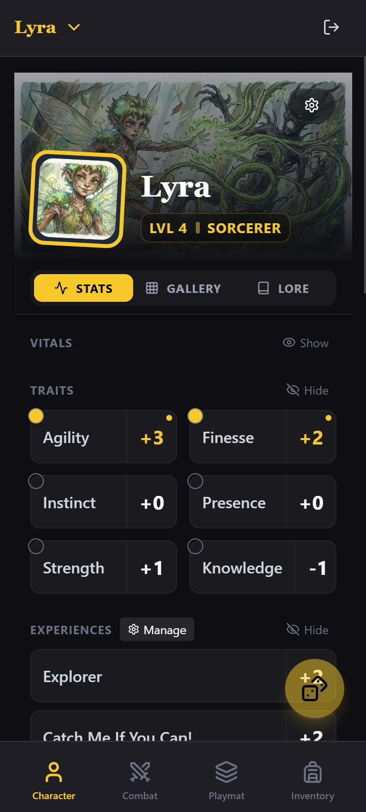
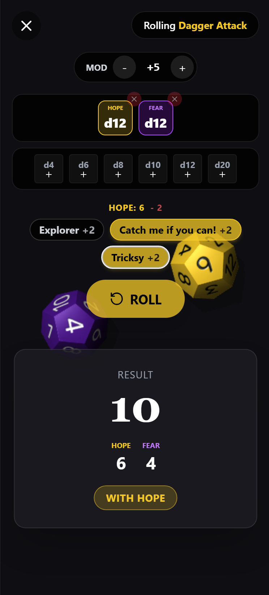

<p align="center">
  
</p>

# Daggerheart Dice & Character Creator

A mobile-first, digital character sheet for the [Daggerheart](https://darringtonpress.com/daggerheart/) Tabletop RPG. Built with Next.js 15, TypeScript, and Supabase.

## Support

If you find this project useful or fun to use, consider sending a "Thank you!"

[](https://buymeacoffee.com/galactic.eye.codex)

Thank you! ☕

## Demo

You can try out a demo of the app here: [**daggerheart-cs-dev.onrender.com**](https://daggerheart-cs-dev.onrender.com/)

<p align="center">
  
  
</p>

## Features & Roadmap

- [x] **Mobile-First Design** - Optimized for portrait mobile usage with touch interactions
- [x] **Cloud Sync** - Character data stored securely in Supabase
- [x] **Google OAuth** - Easy authentication with your Google account
- [x] **3D Dice Rolling** - Interactive dice roller with physics simulation and customizable Hope and Fear dice
- [x] **Card-Based UI** - Manage abilities, equipment, and features as interactive cards
- [X] **Multiclassing Support** - Full support for multiclassing
- [X] **Homebrew Content** - Support for custom domains and cards

## Development Roadmap

### Class & Subclass Interactive Features

| Class | Subclass | Feature | Status | Description |
|-------|----------|---------|--------|-------------|
| Ranger | Beastbound | Companion Card | ✅ Done | Interactive companion sheet with image upload, training options, and companion level-up |
| Bard | All | Rally Die | ❌ Todo | d6 die tracker (upgrades to d8 at level 5) to give to party members |
| Druid | All | Beastform | ❌ Todo | Creature form selector with stats from Beastform creature list (Tiers 1-4) |
| Druid | Warden of the Elements | Elemental Incarnation | ❌ Todo | Element selection (Fire, Earth, Water, Air) for channeling |
| Guardian | All | Unstoppable Die | ❌ Todo | d4 escalating die tracker (upgrades to d6 at level 5) for damage bonus |
| Seraph | All | Prayer Dice | ❌ Todo | d4 roller with prayer dice result tracker (dice equal to Spellcast trait) |
| Sorcerer | Elemental Origin | Element Selection | ❌ Todo | Choose element (air, earth, fire, lightning, water) at character creation |
| Warrior | Call of the Slayer | Slayer Dice | ❌ Todo | d6 dice pool tracker (up to Proficiency dice) for Slayer abilities |
| Wizard | All | Strange Patterns | ❌ Todo | Number selector (1-12) for Strange Patterns class feature |

### Interactive Domain Cards with Tokens

Many domain cards require token tracking. These need dedicated interactive UI:

| Domain | Card | Level | Token Type | Description |
|--------|------|-------|------------|-------------|
| Arcana | Unleash Chaos | 1 | Spellcast tokens | Tokens equal to Spellcast trait, spend for damage dice |
| Arcana | Flight | 3 | Agility tokens | Tokens spent on action rolls while flying |
| Arcana | Confusing Aura | 8 | Layer tokens | Illusion layers that protect against attacks |
| Arcana | Rune Ward | 1 | Ward Die (d8) | Tracks ward status and damage reduction |
| Bone | Strategic Approach | 2 | Knowledge tokens | Combat enhancement tokens |
| Codex | Sigil of Retribution | 6 | d8 dice pool | Accumulates d8s when marked target deals damage |
| Grace | Inspirational Words | 1 | Presence tokens | Healing/support tokens |
| Grace | Invisibility | 3 | Spellcast tokens | Action tokens before invisibility ends |
| Grace | Never Upstaged | 6 | Damage tokens | Bonus damage based on HP marked |
| Midnight | Uncanny Disguise | 1 | Spellcast tokens | Action tokens before disguise drops |
| Midnight | Spellcharge | 8 | Damage tokens | Store magic damage as bonus damage |
| Midnight | Twilight Toll | 9 | Success tokens | Accumulate tokens for bonus damage dice |
| Midnight | Mass Disguise | 6 | Countdown (8) | Ticking countdown until disguise drops |
| Sage | Thorn Skin | 5 | Spellcast tokens | Damage reduction/reflection tokens |
| Sage | Wild Fortress | 5 | HP tokens | Dome hit point tracking (thresholds 15/30) |
| Sage | Wild Surge | 7 | Escalating d6 | Die value increases each roll |
| Sage | Fane of the Wilds | 9 | Domain tokens | Tokens based on Sage cards in loadout/vault |
| Splendor | Zone of Protection | 6 | Escalating d6 | Protection die that increments |
| Splendor | Restoration | 6 | Spellcast tokens | Healing resource tokens |

### Other Features

| Feature | Status | Description |
|---------|--------|-------------|
| Hybrid Ancestries | ❌ Todo | Allow mixing two ancestries, selecting one feat from each |

## UI Design Standards

This project follows consistent design patterns for a polished, cohesive interface:

### Icon Sizing
- **Utility Icons** (Info, Settings, Art, Delete): 12px - Used on card action buttons
- **Navigation Icons** (Activity, Grid, Book): 14px - Used in tab bars
- **Header Icons** (Sword, Layers): 16px - Used in section headers
- **Feature Icons**: 24-28px - Used in ViewHeaders and FAB buttons

### Card Components
All interactive cards share a common pattern:
- **Top-right action overlay**: Contains utility buttons (Info, Art, Settings) with consistent 12px icons
- **Panel styling**: `bg-dagger-panel border border-white/10 rounded-xl`
- **Hover states**: Subtle `hover:bg-white/10` transitions

For detailed component specifications, see `.claude/rules/UI_CARD_REFERENCE.md`.

## Tech Stack

- **Framework:** [Next.js 15](https://nextjs.org/) (App Router)
- **Language:** [TypeScript](https://www.typescriptlang.org/)
- **Styling:** [Tailwind CSS v4](https://tailwindcss.com/)
- **State Management:** [Zustand](https://github.com/pmndrs/zustand)
- **Backend:** [Supabase](https://supabase.com/) (PostgreSQL + Auth)
- **UI Components:** [Radix UI](https://www.radix-ui.com/) (via shadcn/ui)
- **3D Dice:** [@3d-dice/dice-box](https://github.com/3d-dice/dice-box)

## Getting Started

### Prerequisites

- Node.js 20+ installed
- A Supabase account and project
- Google OAuth credentials (for authentication)

### Installation

1. Clone the repository:
```bash
git clone https://github.com/galacticeyecodex-debug/dh-cs.git
cd dh-cs
```

2. Install dependencies:
```bash
npm install
```

3. Set up environment variables:
```bash
cp .env.example .env.local
```

Edit `.env.local` and add your Supabase credentials:
```env
NEXT_PUBLIC_SUPABASE_URL=https://your-project.supabase.co
NEXT_PUBLIC_SUPABASE_ANON_KEY=your_anon_key_here
```

4. **Supabase Setup**:

   This project leverages Supabase for its backend, including the PostgreSQL database and authentication. Follow these detailed steps to set up your own Supabase instance:

   *   **Create a New Supabase Project**:
       1.  Go to [Supabase](https://supabase.com/) and sign up or log in.
       2.  Click "New project" to create a new project.
       3.  Remember your project's **Project URL** and **Anon Key**; these will be needed for your `.env.local` file (Step 3).

   *   **Initialize Database**:
       In your Supabase project dashboard, navigate to the **SQL Editor** and execute the following scripts **in this order**:

       1.  `supabase/schema.sql` - Creates core tables (`profiles`, `character_cards`, etc.) and RLS policies.
       2.  `supabase/seed_library.sql` - Creates `characters` and `library` tables and populates game data.
       3.  `supabase/storage.sql` - Sets up storage buckets for images.

       For each file:
       1.  Open the local file from your cloned repository.
       2.  Copy the entire content into the Supabase SQL Editor.
       3.  Click **Run**.

   *   **Regenerate Game Data (Optional)**:
       The `seed_library.sql` file comes pre-generated. If you need to update game data from the SRD JSON files:
       1.  Run the parser script:
           ```bash
           node scripts/parse_json_srd.js
           ```
       2.  This updates `supabase/seed_library.sql`.
       3.  Re-run `supabase/seed_library.sql` in the Supabase SQL Editor to apply changes.

   *   **Configure Google OAuth (Required for Authentication)**:

       This app uses Google OAuth for user authentication. You'll need to set up OAuth credentials in Google Cloud Console and configure them in Supabase.

       **Step A: Create Google OAuth Credentials**

       1.  Go to [Google Cloud Console](https://console.cloud.google.com/)
       2.  Create a new project or select an existing one
       3.  Navigate to **APIs & Services** → **Credentials**
       4.  Click **Create Credentials** → **OAuth client ID**
       5.  If prompted, configure the **OAuth consent screen**:
           *   User Type: External (unless you have a Google Workspace)
           *   App name: `Daggerheart Companion` (or your preferred name)
           *   User support email: Your email address
           *   Developer contact email: Your email address
           *   Scopes: Add `userinfo.email` and `userinfo.profile`
           *   Test users: Add your Google account email for testing
           *   Click **Save and Continue** through the remaining steps
       6.  Back in **Credentials**, click **Create Credentials** → **OAuth client ID** again
       7.  Application type: **Web application**
       8.  Name: `Daggerheart Web Client` (or your preferred name)
       9.  **Authorized redirect URIs**: You'll get this from Supabase in the next step. For now, leave it blank and click **Create**
       10. Copy the **Client ID** and **Client Secret** - you'll need these for Supabase

       **Step B: Configure Supabase with Google OAuth**

       1.  In your Supabase project dashboard, navigate to **Authentication** → **Providers**
       2.  Find **Google** in the provider list and enable it
       3.  Supabase will display a **Callback URL** (e.g., `https://your-project.supabase.co/auth/v1/callback`)
       4.  Copy this **Callback URL**
       5.  Paste your Google **Client ID** and **Client Secret** from Step A into Supabase
       6.  Click **Save**

       **Step C: Configure Supabase URL Settings**

       1.  In your Supabase project dashboard, navigate to **Authentication** → **URL Configuration**.
       2.  Set **Site URL** to your default site: `https://your-app-name.onrender.com`. If you don't know this yet, proceed to the section on Deploying to Render. If you don't plan to deploy to Render, you can use `http://localhost:3000`.
       3.  Under **Redirect URIs**, add `http://localhost:3000/**` if you also want to enable both the Render deployment and local hosting.
       4.  Click **Save**. If you have redirect issues after Google OAuth, then this is the likely culprit.

       **Step D: Add Callback URL to Google Cloud Console**

       1.  Return to [Google Cloud Console](https://console.cloud.google.com/)
       2.  Navigate to **APIs & Services** → **Credentials**
       3.  Click on your OAuth client ID from Step A
       4.  Under **Authorized redirect URIs**, click **Add URI**
       5.  Paste the **Callback URL** you copied from Supabase (Step B)
       6.  For local development, also add: `http://localhost:3000/auth/callback`
       7.  Click **Save**

       **Step E: Test Authentication**

       1.  Start your development server (`npm run dev`)
       2.  Navigate to your app and try signing in with Google
       3.  If you encounter errors, verify:
           *   The redirect URI in Google Cloud exactly matches the one from Supabase
           *   Your Google account is added as a test user (if app is in testing mode)
           *   Client ID and Secret are correctly entered in Supabase

5. Start the development server:
```bash
npm run dev
```

Visit [http://localhost:3000](http://localhost:3000) to see the app.

### Project Structure

```
dh-cs/
├── app/                  # Next.js App Router pages
│   ├── (playground)/     # Authenticated app views
│   ├── auth/             # Authentication routes
│   └── create-character/ # Character creation wizard
├── components/           # Reusable UI components
│   ├── ui/               # Shadcn/ui primitives
│   ├── views/            # Feature-specific views
│   └── ...               # Various logic-heavy components
├── constants/            # Global constants and config
├── hooks/                # Custom React hooks
├── lib/                  # Utility functions
│   ├── supabase/         # Supabase client utilities
│   └── ...               # Game logic helpers
├── public/               # Static assets
├── scripts/              # Node.js data processing scripts
├── srd/                  # Source of Truth for game data (JSON files)
├── store/                # Zustand state management
└── types/                # TypeScript type definitions
```

## Deployment

This application can be easily deployed to [Render](https://render.com), a unified platform for cloud applications.

### Deploying to Render

1.  **Create a New Web Service**:
    *   Log in to your [Render Dashboard](https://dashboard.render.com/).
    *   Click "New +" -> "Web Service".

2.  **Connect to your Repository**:
    *   Select "Build and deploy from a Git repository".
    *   Connect your GitHub account if you haven't already.
    *   Search for and select the `galacticeyecodex-debug/dh-cs` repository.

3.  **Configure Service Details**:
    *   **Name**: Choose a unique name (e.g., `my-daggerheart-companion`).
    *   **Region**: Select a nearby region.
    *   **Branch**: `main`
    *   **Root Directory**: Leave blank (default).
    *   **Runtime**: `Node`
    *   **Build Command**: `npm run build`
    *   **Start Command**: `npm start`
    *   **Plan Type**: "Free" is enough for a few users.

4.  **Set Environment Variables**:
    Add the following environment variables under the "Environment" tab:

    | Variable | Value | Description |
    | :--- | :--- | :--- |
    | `NEXT_PUBLIC_SUPABASE_URL` | *Your Supabase URL* | From Supabase Settings |
    | `NEXT_PUBLIC_SUPABASE_ANON_KEY` | *Your Anon Key* | From Supabase Settings |

5.  **Deploy**:
    *   Click "Create Web Service".
    *   Render will start building your app. This process may take a few minutes.
    *   Once "Live", your app will be accessible at the URL provided (e.g., `https://your-app.onrender.com`).

6.  **Post-Deployment**:
    *   **Important**: Copy your new Render URL.
    *   Go back to **Supabase > Authentication > URL Configuration**.
    *   Update your **Site URL** to this new Render URL to ensure social login redirects work correctly in production.

## License

This project is licensed under the MIT License - see the [LICENSE](LICENSE) file for details.

## Legal Notice

This product includes materials from the Daggerheart System Reference Document 1.0, © Critical Role, LLC, under the terms of the Darrington Press Community Gaming License. More information at [www.daggerheart.com](https://www.daggerheart.com).

Darrington Press™ and the Darrington Press authorized work logo are trademarks of Critical Role, LLC and used with permission.

## Disclaimer

This application is provided "as-is" without warranty of any kind. While we strive for accuracy, the app may contain bugs or inconsistencies with the official rules. Users are encouraged to verify critical rules with the official Daggerheart publications. Feedback, bug reports, and contributions to improve the app are welcome on GitHub.

## Acknowledgments

- Built with the amazing [Daggerheart SRD](https://darringtonpress.com/daggerheart/)
- SRD compilation by [seansbox](https://github.com/seansbox/daggerheart-srd/)
- Card layout and design inspiration from [daggerheartbrews.com](https://daggerheartbrews.com)
- Original authentication boilerplate from [shsfwork/supabase-auth-nextjs-google-boilerplate](https://github.com/shsfwork/supabase-auth-nextjs-google-boilerplate)
- LLMs were used to generate a lot of the code for this project, so if you have objections to that, you may not want to use this project.
